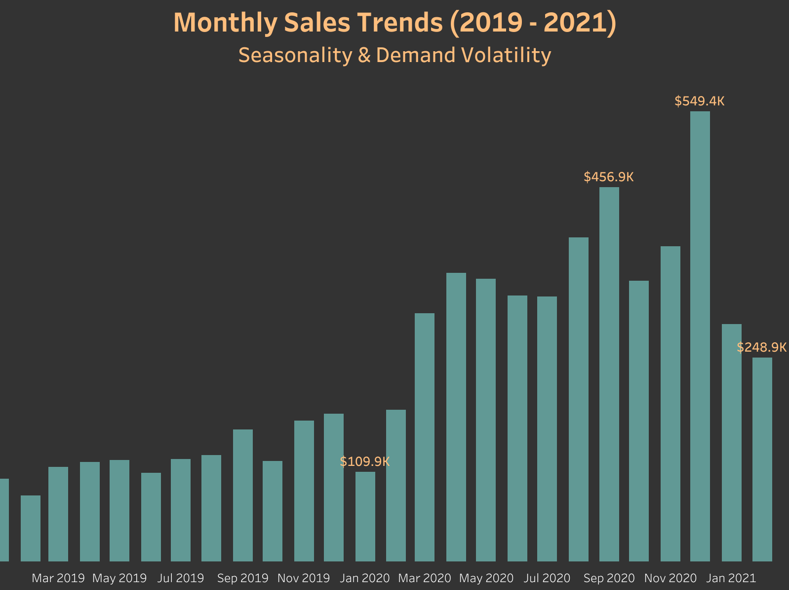
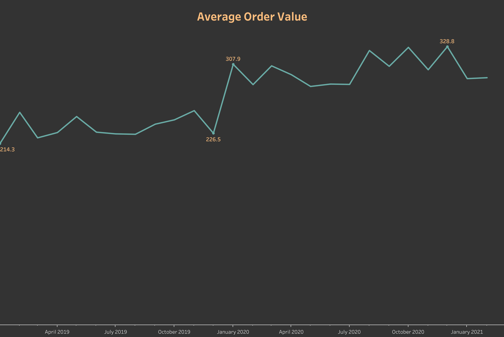
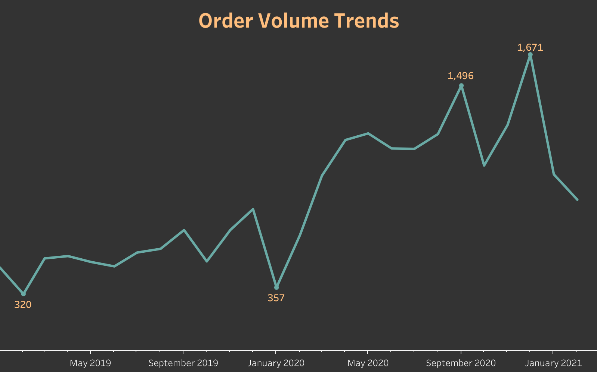
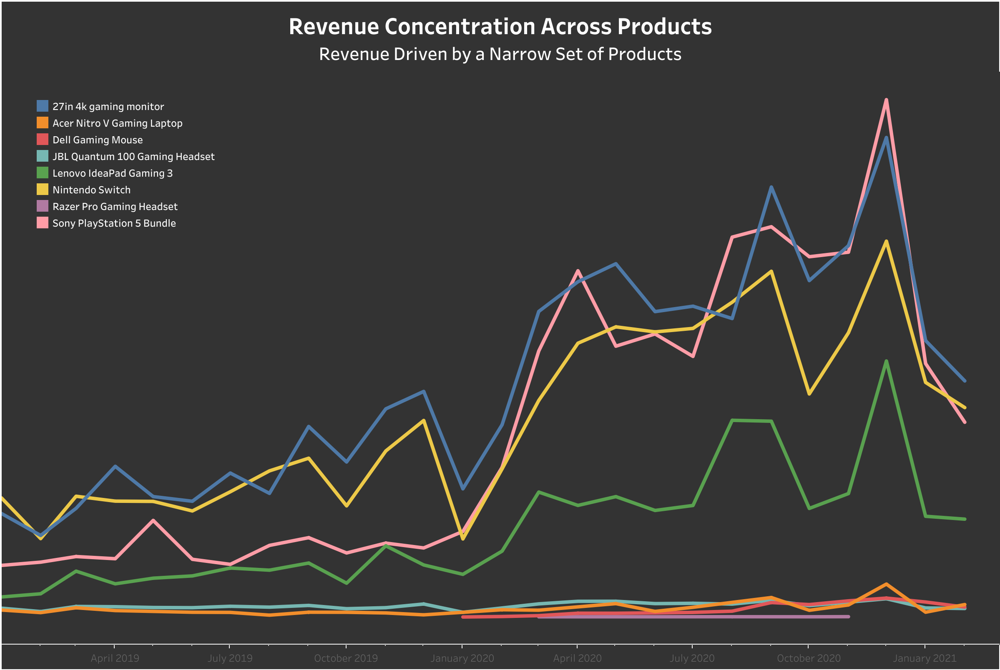
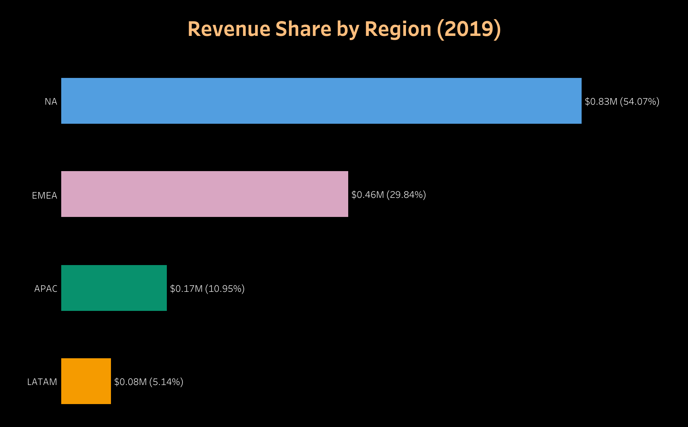
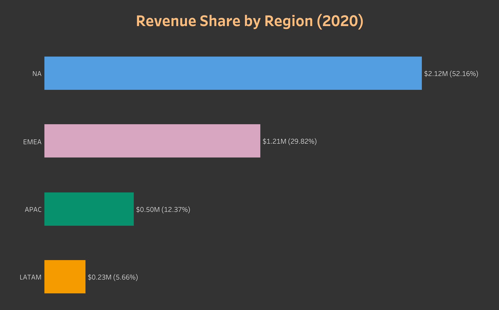
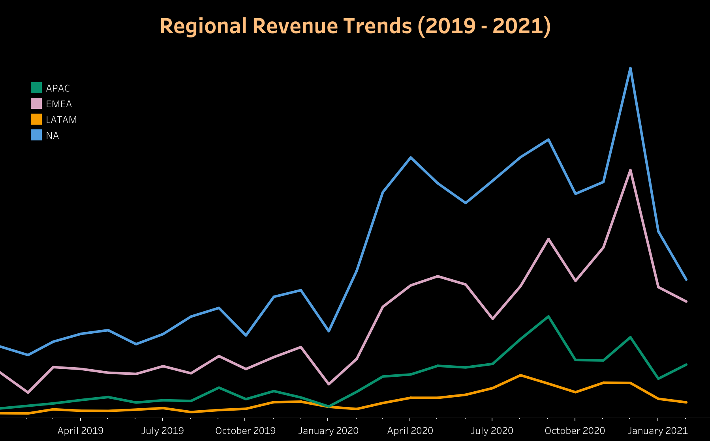

  <h1 style="border: none; padding: 0; margin: 0;">
    E-Commerce Sales and Marketing Performance Analysis
  </h1>

<h2 align="center"> Overview </h2>

This report represents an in-depth analysis of a global e-commerce businesss specializing in popular gaming products. The available data contains approximately 22,000 transactions from 18,000 customers, covering the period from January 2019 to February 2021. The analysis will primarily focus on the 2019 - 2020 period to providing a clearer view of business performance before and during a major shift in global consumer behavior. The objective is to examine sales trends, product performance, and marketing effectiveness in order to identify key revenue drivers, uncover growth opportunities, and understand changes in customer purchasing behavior over time.

The key insights and recommendations of this analysis are structured around the following areas:

- General Sales Trends:
  - Analyze overall performance using key metrics such as total revenue, order volume, and average order value (AOV) to understand demand patterns and year-over-year changes.
- Product Performance:
  - Identify top products that contribute the most to the total revenue and assess their relative impacts on the overall performance of the business.
- Market Share by Region:
  - Evaluate regional contributions to sales, highlighting core revenue-driving markets as well as underperforming regions but show potential investment opportunities.
- Marketing Channels Effectiveness:
  - Evaluate the effectiveness of the business's marketing strategies by analyzing customer acquisition across different channels and identifying which channels contribute most to sales.

**Research Question:**

How do sales performance and marketing effectiveness vary by year, product, region, and channel, and what factors drive changes in revenue and order volume over time?

<h2 align="center"> Data Overview </h2>

<table style="width:100%" align="center">
  <tr>
    <th>Dataset</th>
    <th>Coverage</th>
    <th>Key features</th>
  </tr>

  <tr>
    <td>Gamezone Orders Data</td>
    <td>01/2019 - 02/2021</td>
    <td>Purchase Timestamp, Product, Price, Country, Marketing Channels</td>
  </tr>

  <tr>
    <td>Region</td>
    <td></td>
    <td>Country, Region</td>
  </tr>
</table>

<h2 align="center"> Executive Summary </h2>

This analysis reveals several key patterns in sales and marketing performance:

1. **Sales Growth Accelerated Sharply in 2020, Followed by Early Signs of Decline**

   - Total revenue increased significantly in 2020, reaching $4.07M, representing a 164% year-over-year (YoY) growth.
   - The strongest performance occurred between September and December 2020, with December marking the peak month ($559K).
   - Despite strong annual growth, sales exhibited notable volatility, including a sharp decline in October 2020 and a continued downward trend in early 2021, suggesting that growth momentum may not be sustained without intervention.
  
2. **Revenue Is Highly Concentrated Among Top Products:**

   - A small group of products consistently generated the majority of revenue across both years.
   - This concentration reflects strong product–market fit for core offerings but also introduces dependency risk, as overall performance is heavily influenced by a limited product portfolio.

3. **Sales Trends Are Strongly Influenced by Global and Seasonal Factors:**

   - All regions and products experienced a pronounced decline in late 2019, followed by a sharp increase throughout 2020.
   - This synchronized pattern across markets suggests a macro-level impact, potentially related to shifts in consumer behavior during the COVID-19 period.
   - Seasonal effects are evident, with recurring peaks in September and December in both years, likely driven by promotional cycles and holiday demand, while October consistently underperformed across years.

4. **Marketing Channel Effectiveness Does Not Vary:**

   - Direct traffic dominates sales performance, contributing approximately 70–80% of total revenue.
   - Other channels (email, social media, affiliate) contribute minimally, indicating inefficient channel diversification and potential underinvestment or ineffective execution outside the direct channel.

<h2 align="center"> Insight Deep Dive & Visualizations </h2>

### 💰 Sales Trends

- In 2019, monthly sales remained relatively stable throughout the year, with the strongest performance occurring during September - December period, which generated approximately $637K of the $1.54M annual revenue (around 42% of total sales)
- Despite this strong accomplishment at the end of the year, sales experience a sharp 39% decline in January 2020 (from $180.8K to $109.9K), indicating a significant post-holiday slowdown and an early sign of volatility entering the new year.
- Sales revenue rebounded rapidly in the next few months of 2020. By April 2020, revenue increased by over 220% compared to January 2020 (from $109K to $351K) and nearly 190% compared to April 2019, indicating a pronounced year-over-year surge and a clear deviation from prior patterns.
- Despite this surge, monthly sales patterns reveal strong month-to-month volatility, with recurring declines before and after seasonal peaks. This pattern highlights that customer demand was heavily concentrated around specific promotional or holiday-driven periods rathern than sustained throughout the year.
- Entering 2021, the revenue sharply declined again, with a 47% drop in January, followed by further decline in February, suggests potential demand saturation or weakening consumer engagement.
- **Overall:** Although the difference in total revenue of the 2 seasons are susbtantial, sales followed a consistent seasonal pattern: peak in September and December, followed by decline in adjacent months. This essentially indicates that revenue performance is heavily dependent on late-year seasonal events and promotions, reinforcing the need for adjusting strategies that stabilize general demand outside peak periods.

### 📊 Average Order Value (AOV) and Number of Orders
<h4 align="center">Revenue fluctuations are driven primarily by changes in order volume</h4>

<table align="center">
    <tr align="center">
      <td>
        
      </td>
      <td>
        
      </td>
    </tr>
</table>

- In 2020, Average Order Value (AOV) increased significantly compared to the previous year, with a notable 36% spike in January 2020. This increase coincided with the outbreak of COVID-19, which likely influenced changes in consumer purchasing behavior within the e-commerce market.
- However, higher AOV did not consistently translate into higher revenue. In fact, revenue in January 2020 reach one of its lowest level across the analyzed period, indicating that increasing the AOV alone was insufficient to complement the declines in customer demand.
- Visualizing the number of orders proves that declines in order volume, rather than AOV, were the primary driver of revenue downturns. Order count and total revenue closely mirror each other across both years, emphasizing that decline in revenue primarily due to fewer orders rather than the fluctuation in AOV or price of the products.
  - In January 2020, the number of orders declined by approxiamtely 55%, directly leading to the sharp revenue drop despite having high AOV.
  - Order volume recovered throughout 2020 and peaked in December with 1,671 orders, but also experienced notable declines in October 2020 and again in early 2021.
- **Overall:** While AOV exhibited considerable volatility over the analyzed period, order volume was more likely the main driver of the revenue. This emphasizes the importance of sustaining the consistent demand rather than solely focus on short-term increases in order value.

### 🎮 Product Performance by Year

- **Revenue concentration:**
  - Revenue concentration is highly pronounced, with four products - 27in 4K Gaming Monitor, Nintendo Switch, Sony PlayStation 5 Bundle, and Lenovo IdeaPad Gaming 3 - accounting for approximately 97% of total revenue across both years. This indicates a strong demand for a narrow set of core products, while also exposing the business to significant concentration risk.
  - All remaining products show minimal or inconsistent sales activity, contributing negligibly to overall performance. Notably, the Gaming Headset exhibited persistently weak performance with no recorded sales in multiple months. This may reflect poor product-market fit, ineffective promotions, or potential gaps in sales tracking, and requires further investigation.
  - Seasonality is consistent across all top-performing products, with pronounced sales spikes in September and December. These peaks aligned with back-to-school promotion and holiday shopping periods, reinforcing the importance of seasonal demand in driving overall performance.
 
- **Product AOV:**
  - Product-level AOV patterns vary across years. In 2019, AOV for Playstation and IdeaPad Gaming fluctuated considerably, while Nintendo Switch and Gaming Monitor maintained relatively stable AOV levels in both years. In 2020, AOV for Playstation and IdeaPad became more stable overall, though intermittent highs and lows persisted.
  - Sony Playstation consistently records the highest AOV, while the Gaming Monitor has a comparatively lower AOV among the top products. Despite this, the Gaming Monitor and Nintendo Switch jointly generated approximately $1.06M in revenue in 2019, demonstrating strong demand volume.
  - Sony Playstation, despite being a high-value item, experienced the most significant revenue growth, increasing from $260K in 2019 to $1.19M in 2020. However, the Gaming Monitor remained the top revenue driver in both years, despite its lower AOV.
  - **Overall:** This contrast highlights a key insight: consistent order volume is more critical to sustained revenue performance than high AOV alone. The Gaming Monitor’s stable revenue leadership suggests that frequent purchasing can outperform higher-priced but less consistently ordered products.

### 🌐 Market Share by Region

<table width="1000" align="center">
    <tr align="center">
      <td>
        
      </td>
      <td>
        
      </td>
    </tr>
</table>

<ol>
  <li><strong>Revenue Share by Region:</strong></li>
  <ul>
    <li>
      North America consistently dominates revenue:
      <ul>
        <li>It accounts for over 50% of total sales in both year and serves as the primary revenue driver across all products.</li>
        <li>Revenue in this region increased from $832.7K in 2019 to $2.12M in 2020, representing a 155% year-over-year (YoY) growth, reinforcing North America's central role in overall business performance, but also highlighting the risk of over-reliance on a specific region.</li>
      </ul>
    </li>
    <li>In contrast, Latin America accounts for the smalles sphare (approximately 5%), indicating limited market penetration and relatively low impact on overall performance.</li>
  </ul>
  
  <li><strong>Sales Trends by Region:</strong></li>
  <ul>
    <li>Regional sales trends differed between ealy 2019 and later in 2019:</li>
    <ul>
      <li>In early 2019, North America and EMEA followed similar patterns, both experiencing a noticeable decline in February, while Asia-Pacific and Latin America showed relatively steady growth during the same period, despite their smaller revenue contributions.</li>
      <li>Later in 2019, sales patterns converged across North America, EMEA, and Asia-Pacific, with all three regions peaking in September followed by a significant decline toward November and December, suggesting a global or cross-regional factor that might affect customer demand. Notably, Latin America remained relatively stable during this period, showing less sensitivity to the same demand shifts.</li>
    </ul>
    <li>While in 2020, all regions exhibited highly aligned sales behavior. Each experienced with a sharp decline in early 2020, followed by a strong recovery and peak performance primarily in September and December, although with increased volatility in the latter half of the year. This consistent pattern across regions supports the presence of a global demand shock, likely associated with the COVID-19 pandemic.</li>
  </ul>
</ol>

  

**Overall:** While most regions showed improvement toward the end of 2020, Asia-Pacific was the only region to maintain continued growth into early 2021. Combine with a slight increase in its market share in 2020, this trend highlights Asia-Pacific as a potential emerging growth opportunity.

### 📈 Marketing Channels Effectiveness

- Direct purchases aoverwhelmingly dominates the revenue, contributing approximately 79 - 89% of monthly sales and 84 - 85% annually, while all other marketing channels contribute marginally by comparison. Trends in direct-channel revenue closely mirror the trends of overall sales and order volume, indicating a strong dependence on customers who are already familiar with the brand and navigate directly to the website to complete their purchases.
- This level of reliance on direct traffic is unusual for a typical e-commerce operation and suggests that customer acquisition through alternative marketing channels is either underutilized or ineffective. This disproportionate contribution from direct traffic also warrants a review of marketing attribution logic, as the observed imbalance may reflect limitations in channel tracking rather than true customer acquisiton behavior.
- Among non-direct channels, email shows modest growth potential, indicating opportunities for strategic experimentation and optimization to shift away the revenue concentration on direct traffic.

<h2 align="center"> Conclusion </h2>

### Key Takeaways

- Revenue growth in 2020 was strong but volatile, driven primarily by seasonal demand spikes rather than sustained month-to-month growth. Sales consistently peaked in September and December, followed by sharp declines before and after these periods.
- Order volume rather than AOV is the primary driver of revenue performance. Although AVOV increased at several points, declines in orders count directly led to revenue downturns, indicating that demand consistency is more critical than basket size.
- Revenue is highly concentrated across products and regions. A small number of core products generate the majority of sales, and North America accounts more than half of total revenue in both years, making overall performance is highly sensitive to these segments.
- Regional sales trends are highly synchronized, especially in 2020, suggesting the influence of a global demand shock. However, Asia-Pacific stands out as the only region showing continued growth into early 2021, indicating emerging potential investment.
- Regional demand patterns suggest both mature markets and emerging growth opportunities.
- Marketing performance is heavily skewed toward direct traffic while other acquisition channels play minimal roles, highlighting an imbalanced marketing mix. 

### Business Implications

- The business's current model is highly dependent on seasonality, direct traffic, and a narrow set of products and regions, creating structural risks if customer demand patterns shift.
- Heavy reliance on direct traffic limits the company's ability to scale efficiently and might indicate weaknesses in marketing attribution, channels diversification, and customer acquisition strategies.
- Emerging growth signals in Asia-Pacific suggests that geographic diversification could reduce dependency on mature markets and build long-term resilience.

<h2 align="center"> Recommendations </h2>

**1. Stabilize Demand Outside Peak Seasons:**
  - Develop campaigns and promotions targeting historically weak months (Januay & October)
  - Introduce initiatives such as bundled offers or limited-time incentives to boost customer demands

**2. Prioritize Consistent Demand Growth:**
  - Focus marketing and product strategies on increasing purchase frequency instead of solely relying on higher AOV
  - Optimize conversion funnel and adjust pricing strategies if needed to encourage consistent purchase behavior

**3. Reduce Revenue Concentration Risks:** 
  - Reassess underperforming products and consider discontinuation or repositioning
  - Research and explore opportunities to expand beyondd top-performing products

**4. Diversify Marketing Channels:**
  - Expand and optimize email marketing, which shows potential growth
  - Experiment with social media and affeliate strategies to improve customer discovery as these 2 channels might help reach a broader group of customers.

**5. Invest in Potential Regions:**
  - Use regional insights to guide expansion and localization strategies

<h2 align="center"> Limitations & Potential Improvements </h2>

**Limitations:**

- Marketing spending data is not available (ROI analysis not possible)
- Cost data is not avaialble to evaluate profit
- Lack real-time feedback and guidance from stakeholders to provide clearer insights and recommendations

**Future Improvements:**

- Integrating marketing cost to evaluate ROI
- Performing customer cohort and retention analysis
- Including profitability & margin trends (if available)
- Building simple predictive models for sales forecasting
